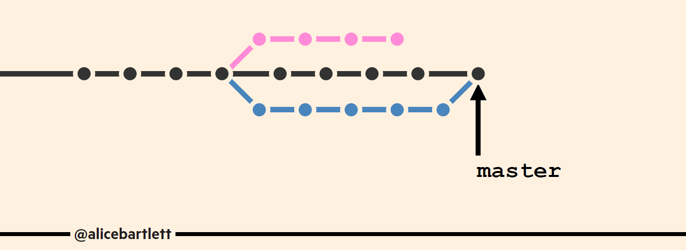

```{r removeSlideNumbers, include=FALSE}
# From https://github.com/rstudio/rmarkdown/issues/244
# To remove slide numbers to one of two things:

# One: Place this under the yamal header of the .Rmd file

# <style type="text/css">
# slides > slide:not(.nobackground):after {
#   content: '';
# }
# </style>


# Or, two: Place this in a separate mystyle.css file (remove <style> tag)

# slides > slide:not(.nobackground):after {
#   content: '';
# }

# For approach two, the yamal header should look like this:
# ---
# output:
#   ioslides_presentation:
    # css: mystyles.css
# ---
```

```{r setup, include=FALSE}
# knitr ----
knitr::opts_chunk$set(
  comment = "#>",
  collapse = TRUE,
  # fig.align = "center",
  fig.asp = 0.618,
  fig.width = 6,
  out.width = "100%",
  cache = TRUE,
  echo = FALSE 
  )
# If you want to make sure the font size is consistent across all your figures,
# whenever you set out.width, you’ll also need to adjust fig.width to maintain
# the same ratio with your default out.width. For example, if your default
# fig.width is 6 and out.width is 0.7, when you set out.width = "50%" you’ll
# need to set fig.width to 4.3 (6 * 0.5 / 0.7).
# plots
```


# Improving the quality of you code and your productivity

### forestgeo.github.io/forestr

### **\@mauro_lepore**


<div class="notes">

- github and rpackages help reproduce  research
- should let us reach your research goals faster
- if you contribute the ball rolls faster and  you get citations, the challenge is not to get published but to be cited.

</div>


## Is most research actually reproducible? Why?

```{r}
knitr::include_graphics("error.png")
```

[Improve the system](http://jamesclear.com/goals-systems)


## What is the benefit of a good system?

```{r, out.width="45%", fig.show='hold'}
knitr::include_graphics("behavioural_architect_bad.jpg")

```

[Behaviour can be designed](http://www.nirandfar.com/)


## You should fall effortlessly into the pit of success

```{r, out.width="70%", fig.align="center"}

```


## What will future-you say about your work now?

```{r}
knitr::include_graphics("bullshit.png")
```


## Improving the quality of our code and our productivity

### _The single biggest way to improve both the quality of your code and your productivity is to reuse good code._ 

-― from "Code Complete (Developer Best Practices)" (https://goo.gl/83hsHb)


# 

### github.com/forestgeo

### __forestr__ package (and friends)


# What do we need and what we have?


## What our good code needs?

A place to live and evolve collaboratively_

- Code repository and forum: GitHub

A structure that makes using  the code easy

- R packages: __forestr__ and friends


## GitHub

```{r}

```


## How do you manage your projects?

```{r}
knitr::include_graphics("framework.png")
```

[Git for Humans](https://speakerdeck.com/alicebartlett/git-for-humans), Alice Bartlett. This gets messy and suggest that projects evolve linearly, which is false.


## Do your projects evolve as a single straight line? | What challenges do you  face?

```{r}

```

[Git for Humans](https://speakerdeck.com/alicebartlett/git-for-humans), Alice Bartlett.

<div class="notes">

What are research projects like?

- complex, 

- involve multiple collaborators,

- variable.

What changes? -> What do you need?

- the data and meta-data -> to track changes/versions;

- access privilege -> to control the level of access that people have

</div>


# GitHub is one useful solution

```{r}
knitr::include_graphics("dogit.png")
```


## What changed? When? Why? Who changed it?

```{r}
knitr::include_graphics("github_what.png")
```

[Happy Git and GitHub for the R useR](https://speakerdeck.com/jennybc/happy-git-and-github-for-the-user) by  Jenny Bryan.


## Can we discuss this change?

```{r, out.width="95%", fig.align="center"}
knitr::include_graphics("metadata.png")
```

Photo from [Happy Git and GitHub for the R useR](https://speakerdeck.com/jennybc/happy-git-and-github-for-the-user) by  Jenny Bryan.


```{r}
xxxcont <- function() {
  "continue  here"
}
```

## Learn more  about GitHub

xxxcont. email sent to Helene


## Show our github page and discuss privacy


## __forestr__

Learn more xxx


...


## Show our  __forestr__ package and compare  it with the CTFS R package

## __forestr__'s friends

- __bci__
- __ttt__

## Where are we heading?

Set priorities

- tell me what you actually use

improve what we have

- documentation
- tests
- tutorials
- refactor

add what you have

create what we lack


where we are heading

- we need better documentation
- more tests
- list priorities
- new code

how to contribute


title and contact details

- twitter maurolepore
- github forestgeo


engage audience with questions

- who uses github
    - how many people know about the CTFS R package
    - how many people use the CTFS R package


idea: the pit of success. the field guide to human error


why listen? show some bits of progress so people get excited.

- I'm here to help. What my job is?

# What I ask | How can you contribute?


what I  am asking people to do

contribute
   - re-write documentation
   - tell me your issues
   - tell me your interests
   - review material
   - contribute code
   - what would you like to leran

- ask

    - 
    - what they want to hear about?
        - what functions they use
        - what problems they find
    - meeting session to discuss ideas
        - code to contribute
        - workshops


# What else?


# Show

- ttt as an example of contribution by a researcher. How a script was transformed into a function, a website, a vignette
- how to file an issue, e.g. report a problem
- how to file a pull request, e.g. edit documentation
- how to follow advances in #forestgeo #forestr
- 


### Topics may be useful to share

Fall in the pit of success of reproducible research
- project management (RStudio, r projects and packages)
- github
- tidyverse

- list recommended resources
    - rstudio webinars
    - r4ds
    - other books

- tips of the day
    - how to find stuff
    - recommend use of tags (shortcut `Ctrl+Alt+x`)
    - reprex::reprex()
    - shortcuts, how to find all of them and 
    - cheetsheets
    - webinars
    - free private repositories on github academic
    - free private repositories on bitbucket
    - how to create a package
    - tidyr
    - dplyr
    - readr
    - ggplot2
    - write an outline of your script with
        - sections Ctrl + Shift+ O
        - and shortcut Ctrl + Shift + O
    - package data
    


# code repository

```{r}
# knitr::include_graphics("insert_narrow_image.png")
```

<div class="notes">

...

</div>


