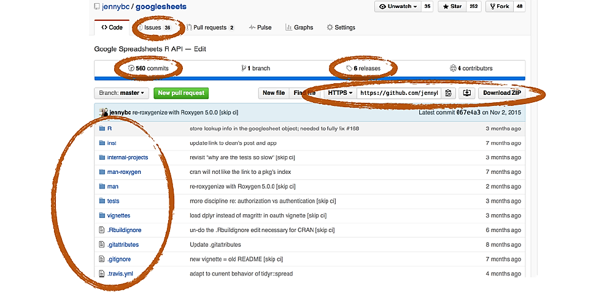
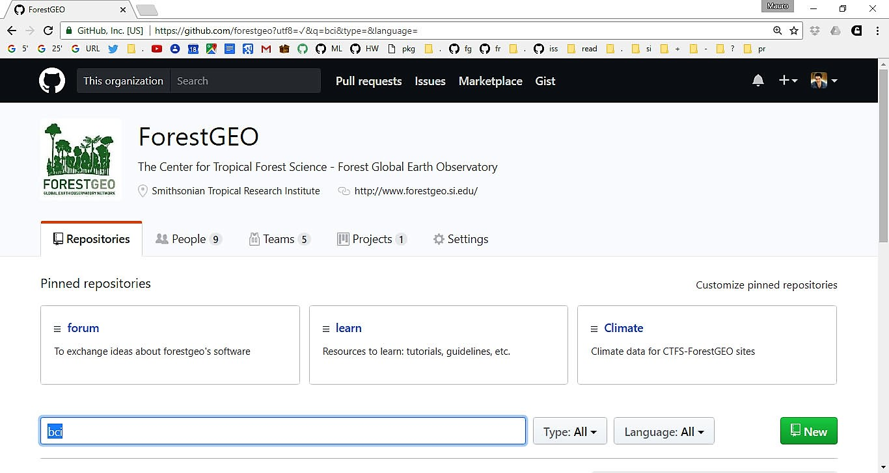
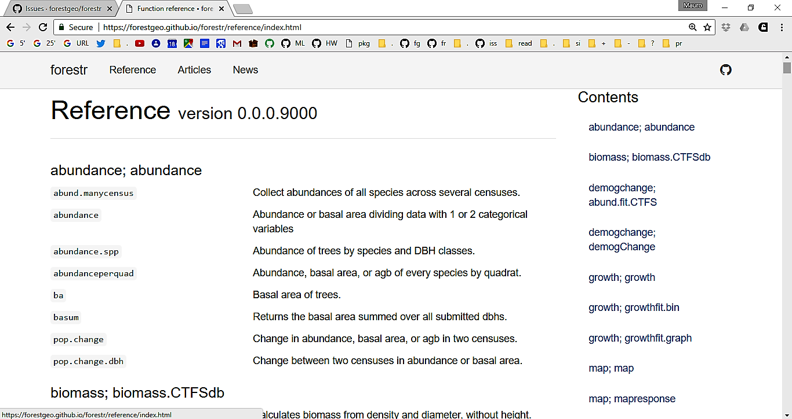
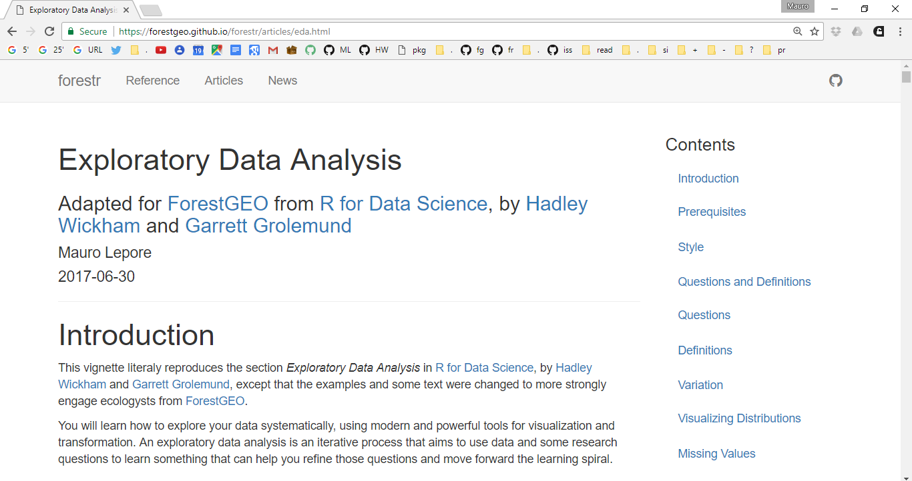
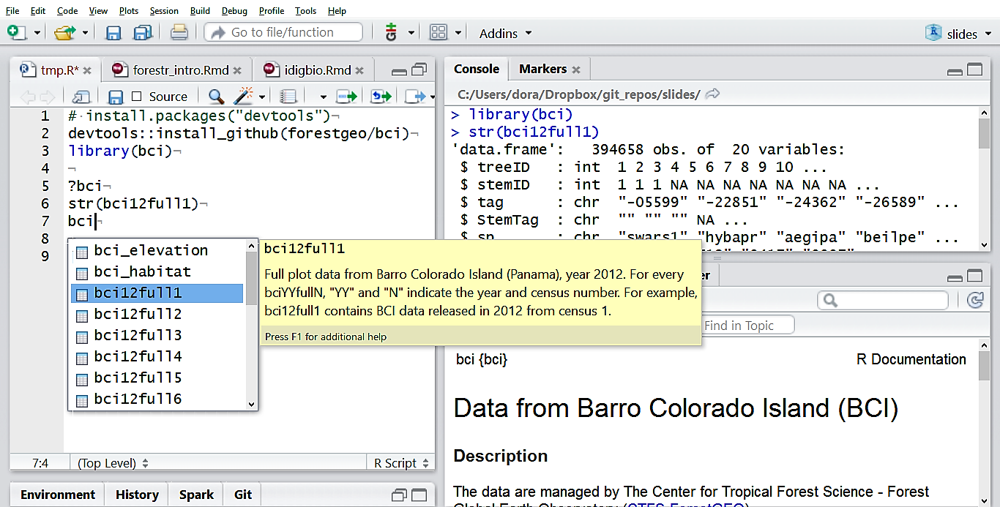
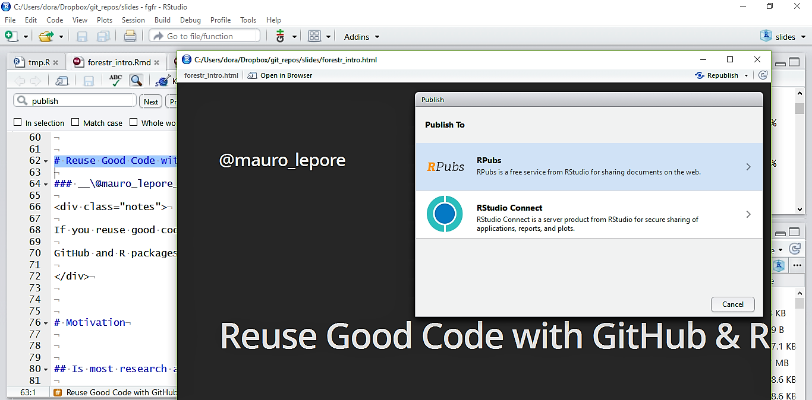
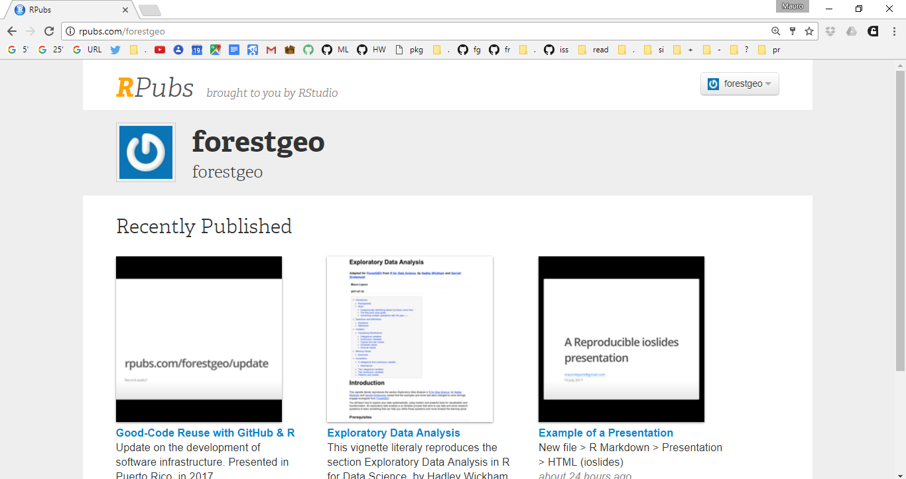
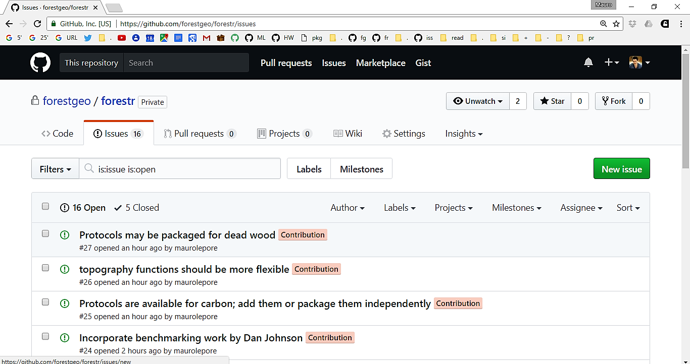
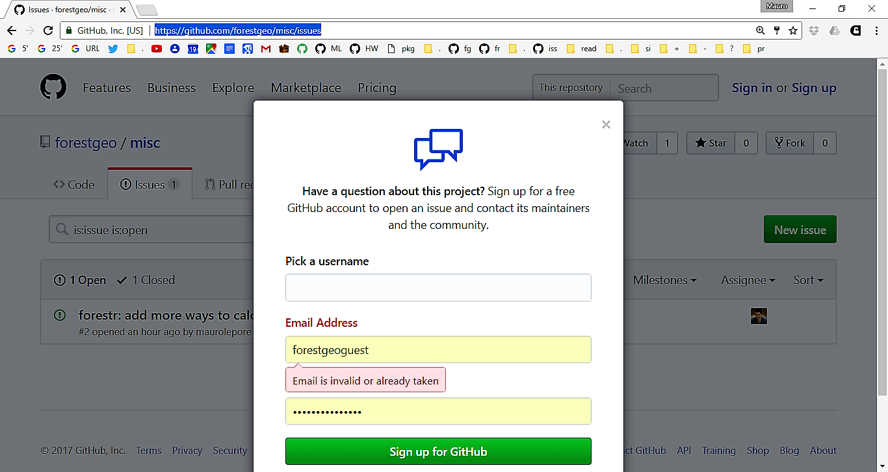
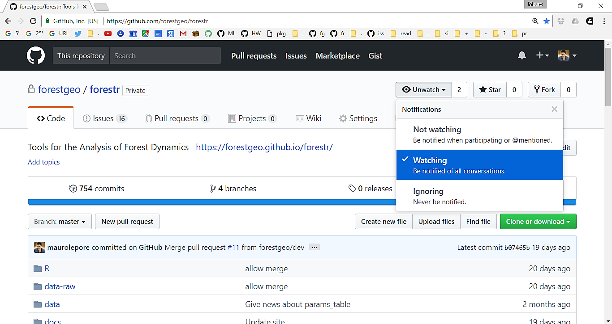

```{r removeSlideNumbers, include=FALSE}
# From https://github.com/rstudio/rmarkdown/issues/244
# To remove slide numbers to one of two things:

# One: Place this under the yamal header of the .Rmd file

# <style type="text/css">
# slides > slide:not(.nobackground):after {
#   content: '';
# }
# </style>


# Or, two: Place this in a separate mystyle.css file (remove <style> tag)

# slides > slide:not(.nobackground):after {
#   content: '';
# }

# For approach two, the yamal header should look like this:
# ---
# output:
#   ioslides_presentation:
    # css: mystyles.css
# ---
```

```{r setup, include=FALSE}
library(knitr)

knitr::opts_chunk$set(
  comment = "#>",
  collapse = TRUE,
  # fig.align = "center",
  fig.asp = 0.618,
  fig.width = 6,
  out.width = "100%",
  cache = TRUE,
  echo = FALSE 
  )
# If you want to make sure the font size is consistent across all your figures,
# whenever you set out.width, you’ll also need to adjust fig.width to maintain
# the same ratio with your default out.width. For example, if your default
# fig.width is 6 and out.width is 0.7, when you set out.width = "50%" you’ll
# need to set fig.width to 4.3 (6 * 0.5 / 0.7).
# plots
```


# Good-Code Reuse with GitHub & R | Update & How You Can Contribute

### __\@mauro_lepore__

<div class="notes">

If you reuse good code you can be more productive.

GitHub and R packages can help you do that.

</div>


## Overview

__My goal: to learn how I can help you__

- Show progress and outline future direction

- Show how you can contribute

- Discussion focused on the why and what, not how

- Mechanics via listed resources or see me later


## Do you use the CTFS R package? What functions?


# Update | forestgeo & forestr


## A good system lets you fail safely

```{r error-field-guide}
knitr::include_graphics("error.png")
```


## Fast failure means fast feedback

```{r fail-safely}

```


## You should fall effortlessly into the pit of success

```{r fall-in-pit-of-success, out.width="70%", fig.align="center"}
knitr::include_graphics("pit.jpg")
```


# GitHub | github.com/forestgeo

### [Why?](https://goo.gl/PRtpmZ) & [How?](http://r-pkgs.had.co.nz/git.html)


## You may have a good system already

```{r projects-how-we-manage}
knitr::include_graphics("framework.png")
```


## Real projects are complex | Is there a better system?

```{r projects-not-linear}
knitr::include_graphics("branch.png")
```

[Git for Humans](https://speakerdeck.com/alicebartlett/git-for-humans), Alice Bartlett.


## GitHub gives you research super-powers

```{r control}
knitr::include_graphics("dogit.png")
```


## 

```{r overview-github}

```

[Happy Git and GitHub for the R useR](https://speakerdeck.com/jennybc/happy-git-and-github-for-the-user) by  Jenny Bryan.


## Data and metadata stay synchronized

```{r discuss-change, out.width="95%", fig.align="center"}
knitr::include_graphics("metadata.png")
```

Photo from [Happy Git and GitHub for the R useR](https://speakerdeck.com/jennybc/happy-git-and-github-for-the-user) by  Jenny Bryan.


## We have public and private repos (see enterprise)

```{r gitub-forestgeo}

```


# R packages | github.com/forestgeo/forestr


## ___The single biggest way to improve both the quality of your code and your productivity is to reuse good code.___

### -― from "[Code Complete (Developer Best Practices)](https://goo.gl/83hsHb)"


## Wouldn't this be nice?

```{r rstudio-help}

```


```{r website-refs}

```


## 

```{r website-funs-help}

```


## 

```{r articles-eda}

```


## `devtools::create("bci")` [r-pkgs.had.co.nz](http://r-pkgs.had.co.nz/)

```{r data-packages-bci}

```


# How You Can Contribute


## Share R products: they are easy to publish 

```{r publish-rpubs-button}

```


## Publish publicly

```{r publish-rpubs}

```


## Publish privately

```{r publish-bookdown}

```


## File issues ([ template](https://github.com/forestgeo/learn/issues/20))

```{r report-issues-forestr}

```


## Issues: use your account or forestgeoguest

```{r report-issues-misc}

```


## Contribute code

```{r ttt}

```


## Get emails about packages you like

```{r follow-watch-forestr}

```


## Keep updated

```{r follow-search-twitter}

```


## Summary

### You already have some new tools

### More tools are comming

### You have multiple ways to help

### Stay tuned


## Thank you all; also thanks to:

Supported the project with code or ideas: 

### __Gabriel Arellano, Sabrina Russo, SeanMcMahon and lab, Suzanne Lao, Kristina Teixeira and other participants of the databases workshop 2017, Stuart Davies.__

.

Supported me with administration:

###__Smithsonian HR, Adriana Bilgray and team, Haley Overstreet, Lauren Krizel.__


# Discussion | __\@mauro_lepore__


# Resources


##

Books: excellent and free

- [R for data science](http://r4ds.had.co.nz/)
  
- [R packages](http://r-pkgs.had.co.nz/)
  
    - chapter on [Git and GitHub](http://r-pkgs.had.co.nz/git.html)
      
- [Advanced R](http://adv-r.had.co.nz/)
    

[Some excellent Webinars](https://www.rstudio.com/resources/webinars/); see rstudio conference 2017

[Data Science in the Tidyverse – Hadley Wickham](https://www.rstudio.com/resources/videos/data-science-in-the-tidyverse/),  by Hadley Wickham

__[The tidyverse style guide](http://style.tidyverse.org/)__


# 

end

# xxxcont.

- edit documentation and code: __add to how to contribute__

- tell me what you would like to learn more about

- shall we have a tip of the day?

- shall we have meetings during this workshop?


## Topics that may be useful to share


- project management (RStudio, r projects and packages)
- github
- tidyverse


## Tips that may be useful to share

- how to find stuff
- recommend use of tags (shortcut `Ctrl+Alt+x`)
- reprex::reprex()
- shortcuts, how to find all of them and 
- cheetsheets
- webinars
- free private repositories on github academic
- free private repositories on bitbucket
- how to create a package
- tidyr
- dplyr
- readr
- ggplot2
- write an outline of your script with
    - sections Ctrl + Shift+ O
    - and shortcut Ctrl + Shift + O
- package data
    


# Misc

```{r}
# knitr::include_graphics("some_image.png")
```

<div class="notes">

Invisible notes.

</div>


