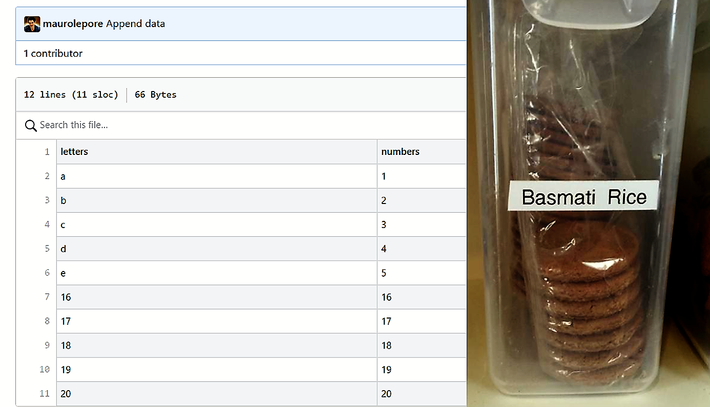
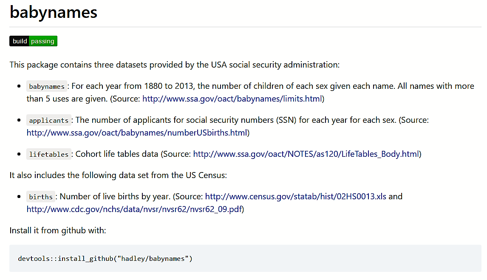
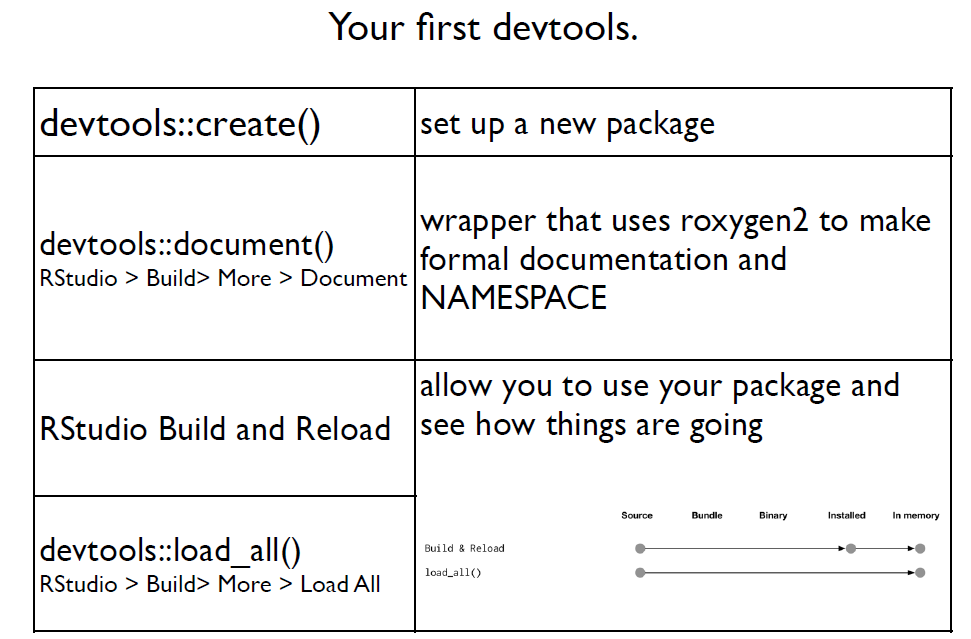
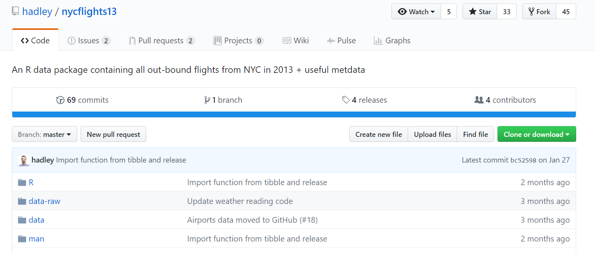
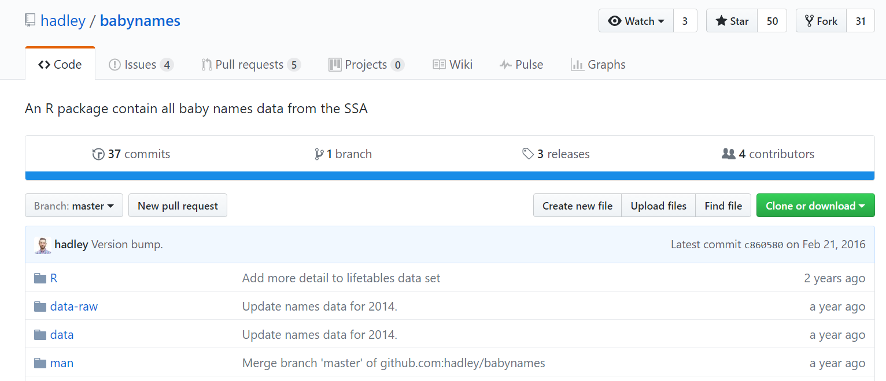

```{r removeSlideNumbers, include=FALSE}
# From https://github.com/rstudio/rmarkdown/issues/244
# To remove slide numbers to one of two things:

# One: Place this under the yamal header of the .Rmd file

# <style type="text/css">
# slides > slide:not(.nobackground):after {
#   content: '';
# }
# </style>


# Or, two: Place this in a separate mystyle.css file (remove <style> tag)

# slides > slide:not(.nobackground):after {
#   content: '';
# }

# For approach two, the yamal header should look like this:
# ---
# output:
#   ioslides_presentation:
    # css: mystyles.css
# ---
```

```{r setup, include=FALSE}
# knitr ----
knitr::opts_chunk$set(
  comment = "#>",
  collapse = TRUE,
  # fig.align = "center",
  fig.asp = 0.618,
  fig.width = 6,
  out.width = "100%",
  cache = TRUE,
  echo = FALSE 
  )
# If you want to make sure the font size is consistent across all your figures,
# whenever you set out.width, you’ll also need to adjust fig.width to maintain
# the same ratio with your default out.width. For example, if your default
# fig.width is 6 and out.width is 0.7, when you set out.width = "50%" you’ll
# need to set fig.width to 4.3 (6 * 0.5 / 0.7).
# plots
```

# Manage and Share Data | **\@mauro_lepore**

```{r}

```

(Via Jenny Bryan)

<div class="notes">

Paleontologists and other researchers need to manage and share data, and this is challenging because research projects are generally complex and dynamic. To face that challenge, one particularly useful tools is GitHub.

Have any of you heard of GitHub before? And used it?

</div>

## Further your research with GitHub

```{r}

```

Linus Torvalds created Git, with a user-unfriendly interphase (from [Git for Humans](https://speakerdeck.com/alicebartlett/git-for-humans), Alice Bartlett)

<div class="notes">

GitHub is like a car with an engine. The engine of GitHub is called Git. 

But I won't tell you about the engine but about the whole car. Because you can drive a car around the world knowing close to nothing about its engine.

This is good news, because engines, including Git, are OK for mechanics but generally unfriendly to the user. 

So this talk about how to use GitHub as a vehicle to take your research further.

</div>

# Outline

### Define the problem we need to solve

### Argue that GitHub is one useful solution

### Show an example

## How do you manage and share data?

```{r}
knitr::include_graphics("framework.png")
```

[Git for Humans](https://speakerdeck.com/alicebartlett/git-for-humans), Alice Bartlett.

## What challenges research projects rise?

```{r}
knitr::include_graphics("branch.png")
```

[Git for Humans](https://speakerdeck.com/alicebartlett/git-for-humans), Alice Bartlett.

<div class="notes">

What are research projects like?

- complex, 

- involve multiple collaborators,

- variable.

What changes? -> What do you need?

- the data and meta-data -> to track changes/versions;

- access privilege -> to control the level of access that people have

</div>

## Is your system error prone?

```{r}
knitr::include_graphics("error.png")
```

<div class="notes">

We don't get as much as we could from the data. Worse, data may be risked or unshared and research slowed. 

</div>

## How to control "human error"? | Do you [design behaviour](http://www.nirandfar.com/) with [focus on systems](http://jamesclear.com/goals-systems)?

```{r, out.width="45%", fig.show='hold'}
knitr::include_graphics("behavioural_architect_bad.jpg")
knitr::include_graphics("behavioural_architect_good.jpg")
```

## Why would future-you thank present-you?

```{r}
knitr::include_graphics("bullshit.png")
```

# GitHub is one useful solution

```{r}
knitr::include_graphics("dogit.png")
```

## What project information is useful? | What changed? When? Why? Who changed it?

```{r}
knitr::include_graphics("github_what.png")
```

[Happy Git and GitHub for the R useR](https://speakerdeck.com/jennybc/happy-git-and-github-for-the-user) by  Jenny Bryan.

## Can we discuss this change?

```{r, out.width="90%", fig.align="center"}

```

## Can we discuss this change?

```{r, out.width="90%", fig.align="center"}
knitr::include_graphics("metadata.png")
```

## How much complexity can GitHub handle?


## How much complexity can GitHub handle?

### Collaborators

- users
- teams of users

### Privileges

- admin
- write
- read
- none

### Protection

specific project branches

## How GitHub plays with R packages?

```{r, out.width="90%", fig.align="center"}

```

## Why manage and share data in R packages? 

## 

```{r, out.width="90%", fig.align="center"}
  
```

## 

```{r, out.width="90%", fig.align="center"}
knitr::include_graphics("rpkg.png")
```

##


- Interface to GitHub (to commit, pull and push)

- Get data and documentation into R with `install_github()`

- Help to build and document the package via devtools and rogygen2

- Access data from many projects easily

- Privacy control

    - public or private repos
    - manage access of collaborators, teams
    - private source yet downloadable data via 

```
`install_github("<PACKAGE>", `auto_token`)
```

# Example

## GitHub structure

- Organization (admin/member)
    - Teams (read/write)
        - Members
        - Collaborators (extra control layer)

- Branches (protected/not/who edits)

# Conclusion

- Do you want to get more out of your data?

- Do you want to struggle less in the process?

### Have you tried GitHub?

# end

# Supplement

## 

```{r, out.width="90%", fig.align="center"}

```

## 

```{r, out.width="90%", fig.align="center"}

```

## Action

### How to do it

- show examples. maybe slides, live programming may be clunky

### Give and get

COSTS TO YOU 

* 2' to open account

* 10' hello world

* ...

BENEFITS TO YOU

* website for your projects

* time travel

* discussion platform optionally bypass emails

* true collaboration

* privacy

* whats's here? when last changed? who changed it? Why? Oh, I want that version! https://speakerdeck.com/jennybc/happy-git-and-github-for-the-user


* diff https://speakerdeck.com/jennybc/happy-git-and-github-for-the-user

* metadata is the data https://speakerdeck.com/jennybc/happy-git-and-github-for-the-user


## Resources

Lots of links to everything. Here or **as I go**?

* GitHub hello world https://guides.github.com/activities/hello-world/

* Happy git and github for the useR http://happygitwithr.com/


* books by Hadley?

    * R Packages, chapter on git and github http://r-pkgs.had.co.nz/git.html

### presentation

- [Happy Git and GitHub for the useR](https://speakerdeck.com/jennybc/happy-git-and-github-for-the-user) (Jenny Bryan)

- [Git for Humans](https://speakerdeck.com/alicebartlett/git-for-humans) (Alice Bartlett)


## Invisible

<div class="notes">

USEFULL LINKS

**bookdown.org/maurolepore/idigbio**

### [wiki](https://goo.gl/p19EeC)


SCOPE

- GitHub + R; but + * maybe OK
- No databases; but see dplyr
- from solo to ### collaborators
- (free)* software

* free private GitHub for science

STRUCTURE AND SYSTEMS

Data raw
    Document cleaning
Data private
    Document
        Private (private repo)
        Public (gh pages)
    Distribute (install_github)
        Private (GitHub privileges)
        Limited (hack: authorised guest token)
Data public
        Public (private repo)
        Public (gh pages)


1 project, public/private data
(1 local repo; 2 remotes)
  data-master push data
  data-private push data-private


TOOLS

dplyr


Document: metadata

Problems:
- Metadata unapdated (cookies in rice container, by Jenny Bryan)


Github & R: give structure

</div>


## Toolsbox

<div class="notes">

xxxnotes; publish; allow pop-ups; add myslides.html?presentme=true (exit =false)

</div>

<div class="columns-2">

</div>


```{r}
# knitr::include_graphics("xxx")
```

## Todo

<div class="notes">

- find out story of fuck git photo at https://www.rstudio.com/resources/videos/happy-git-and-gihub-for-the-user-tutorial/

- add photo of google docs, dropbox, ....

</div>


