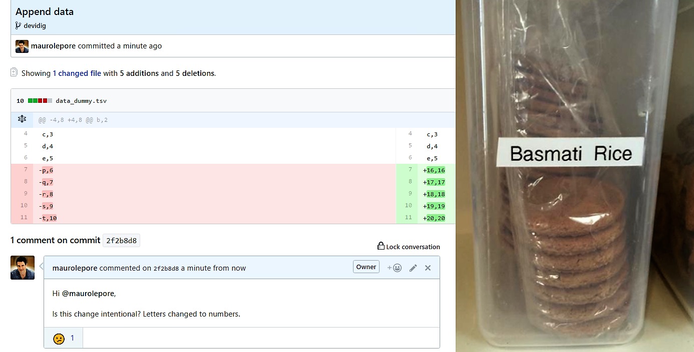

```{r removeSlideNumbers, include=FALSE}
# From https://github.com/rstudio/rmarkdown/issues/244
# To remove slide numbers to one of two things:

# One: Place this under the yamal header of the .Rmd file

# <style type="text/css">
# slides > slide:not(.nobackground):after {
#   content: '';
# }
# </style>


# Or, two: Place this in a separate mystyle.css file (remove <style> tag)

# slides > slide:not(.nobackground):after {
#   content: '';
# }

# For approach two, the yamal header should look like this:
# ---
# output:
#   ioslides_presentation:
    # css: mystyles.css
# ---
```

```{r setup, include=FALSE}
# knitr ----
knitr::opts_chunk$set(
  comment = "#>",
  collapse = TRUE,
  # fig.align = "center",
  fig.asp = 0.618,
  fig.width = 6,
  out.width = "100%",
  cache = TRUE,
  echo = FALSE 
  )
# If you want to make sure the font size is consistent across all your figures,
# whenever you set out.width, you’ll also need to adjust fig.width to maintain
# the same ratio with your default out.width. For example, if your default
# fig.width is 6 and out.width is 0.7, when you set out.width = "50%" you’ll
# need to set fig.width to 4.3 (6 * 0.5 / 0.7).
# plots
```

# Manage and Share Data

### **\@mauro_lepore**

```{r}
knitr::include_graphics("ghpkg.png")
```

<div class="notes">

Paleontologists and other researchers need to manage and share data, and this is challenging because research projects are generally complex and dynamic. To face that challenge, one particularly useful tools is GitHub. And if you use R, then R packages make your life easier.

Have any of you heard of GitHub before? And used it?

</div>

## How do you manage and share data?

```{r}
knitr::include_graphics("framework.png")
```

[Git for Humans](https://speakerdeck.com/alicebartlett/git-for-humans), Alice Bartlett. This gets messy and suggest that projects evolve linearly, which is false.

## Do your projects evolve as a single straight line? | What challenges do you  face?

```{r}
knitr::include_graphics("branch.png")
```

[Git for Humans](https://speakerdeck.com/alicebartlett/git-for-humans), Alice Bartlett.

<div class="notes">

What are research projects like?

- complex, 

- involve multiple collaborators,

- variable.

What changes? -> What do you need?

- the data and meta-data -> to track changes/versions;

- access privilege -> to control the level of access that people have

</div>

## Can your system control the  consequences? | Is your system error prone?

```{r}
knitr::include_graphics("error.png")
```

## What will future-you say about your work now?

```{r}

```

## Can a better system help you?

```{r, out.width="45%", fig.show='hold'}
knitr::include_graphics("behavioural_architect_bad.jpg")
knitr::include_graphics("behavioural_architect_good.jpg")
```

[Behaviour design](http://www.nirandfar.com/); [Focus on systems](http://jamesclear.com/goals-systems).

# GitHub is one useful solution

```{r}

```

## What changed? When? Why? Who changed it?

```{r}
knitr::include_graphics("github_what.png")
```

[Happy Git and GitHub for the R useR](https://speakerdeck.com/jennybc/happy-git-and-github-for-the-user) by  Jenny Bryan.

## Can we discuss this change?

```{r, out.width="95%", fig.align="center"}

```

Photo from [Happy Git and GitHub for the R useR](https://speakerdeck.com/jennybc/happy-git-and-github-for-the-user) by  Jenny Bryan.

## How much structure can I handle with GitHub?


## How I manage privileges among collaborators?

### Collaborators

- users
- teams of users

### Privileges

- admin
- write
- read
- none

### Protection

specific project branches


# R packages make it easier

### Manage and share data

## How hard is it to create an R package?

```{r}
knitr::include_graphics("rpkg.png")
```

```R
devtools::install_github("<GITHUB_USER>/<PACKAGE>")
```
## How can you access R-pkg data and meta-data?

```{r, out.width="90%"}

```

## Where to from here?

* [GitHub hello world](https://guides.github.com/activities/hello-world/), 10' read.

* Happy git and github for the useR [book](http://happygitwithr.com/) and [presentation](https://speakerdeck.com/jennybc/happy-git-and-github-for-the-user), by Jenny Bryan.

* [Git for Humans](https://speakerdeck.com/alicebartlett/git-for-humans), presentation by Alice Bartlett.

* [R Packages](http://r-pkgs.had.co.nz/git.html), book by Hadley Wickham (includes chapter on git and github).


# GitHub and R packages | @mauro_lepore

### Manage and share data

with

#

end
