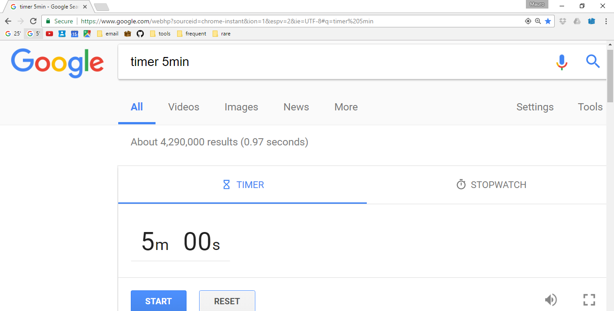

```{r setup, include=FALSE}
knitr::opts_chunk$set(
  comment = "#>",
  collapse = TRUE,
  echo = FALSE
  )
```

## What are your pragmatic solutions?

```{r, out.width="100%", echo=FALSE}
knitr::include_graphics("desk_water_stand.jpg")
```

## Outline

- Where to aim philosophically

- How to get there

- Brake 5' sharp

- Applications in research

- Questions and answers

# From principles to actions

### Where to aim.

- Principles are guiding propositions, not rules.

## Do you think beyond the immediate problem?

Pragmatic people solve problems with special

- **attitude**, 

- **style**, 

- **philosophy.**

--

[The Pragmatic Programmer](https://www.amazon.com/Pragmatic-Programmer-Journeyman-Master/dp/020161622X)


## Do you think beyond the immediate problem?

### _Solve problems with special [Attitude, style, philosophy](https://www.amazon.com/Pragmatic-Programmer-Journeyman-Master/dp/020161622X)_

```{r, echo=FALSE, out.width="85%", fig.align='center'}
knitr::include_graphics("pragmatic_brain.jpg")
```

## Do you improve continuously?


### Japanese business philosophy of continuous improvement of working practices & personal efficiency.

## Do you stop decay as early as possible?

### **Don't leave broken windws!** 

```{r, echo=FALSE, out.width="100%"}
knitr::include_graphics("dont_leave_broken_windows.jpg")
```

### [_Neglect accelerates the rot faster than any other factor_.](http://www.artima.com/intv/fixit.html)

# How to actually get there

- Examples illustrate principles, they are not recipes

## Do you invest in future-you?

### **If it's cost-effective, Don't Repeat Yourself** ([DRY](https://en.wikipedia.org/wiki/Don't_repeat_yourself))

Example: use email's [search operators](https://support.google.com/mail/answer/7190?hl=en) and save ([bookmarks](https://drive.google.com/open?id=0B5fCyFlg2t4pcDlIVHg5VlJZdkE)).

```{r, out.width="100%"}
knitr::include_graphics("check_email.png")
```

## Do you design your behaviour?

- [Behaviour can be designed](http://www.nirandfar.com/) (e.g. google, email, facebook)

- Focus on [systems, not goals](http://jamesclear.com/goals-systems)

```{r, out.width="50%", fig.show='hold'}
knitr::include_graphics("behavioural_architect_bad.jpg")
knitr::include_graphics("behavioural_architect_good.jpg")
```

## Do you hook new habits to old habits?

```{r, out.width="80%", echo=FALSE, fig.align='center'}
knitr::include_graphics("sink.jpg")
```

### _We are what we repeatedly do. Excellence, then, is not an act, but a habit_ (Aristotle).

# .

```{r, out.width="100%", echo=FALSE, fig.align='center'}

```

### **Next: Applications in research**

# Applications in research

Recap

## Do you [work around energy](http://jamesclear.com/productivity) or time?

### The [5-step model](http://jamesclear.com/five-step-creative-process)

1. **gather material**, 
2. **work intensely** over the material in your mind,
3. **step away** from the problem, 
4. **LET IDEAS RETURN NATURALLY**,
5. **test and adjust** your idea based on feedback.

--

(The secret of [the most productive R programmer](https://www.quora.com/How-is-Hadley-Wickham-able-to-contribute-so-much-to-R-particularly-in-the-form-of-packages).)

## When/where do you say _[AHA!](https://youtu.be/lnGeZsv1aBM)_?

(LET IDEAS RETURN NATURALLY.)

_AHAs_ are worth [books](https://www.amazon.com/Gopens-Expectation-Approach-English-Language-ebook/dp/B01D0Z7GC6).

### **This is when I said _AHA!_ over the past few days**

- Start with the ear muffs' story: sleeping
- Spiral (next slide): doing push-ups

## Do you feel you go around in circles?

### The progress we fell, want and achieve.


## What cognitive/practical tools you use? 

| Task | resource | tool/principle |
| :--- | :------- | :--------- |
| Write (and think [*]) | [Turbocharge your writting](http://www.nature.com/naturejobs/2011/110707/pdf/nj7354-129a.pdf) | principle |
| Edit | [Goepen & Swan](http://www.americanscientist.org/issues/id.877,y.0,no.,content.true,page.1,css.print/issue.aspx); [Style](http://worldwordweb.com/writing/Style%20Lessons%20in%20Clarity%20and%20Grace%20(11th%20Edition).pdf) | principle |
| Communicate | [R Markdown](http://rmarkdown.rstudio.com/) | tool |
| Capture & track ideas | GitHub [Gists](https://help.github.com/articles/about-gists/) & [GistBox](https://app.gistboxapp.com/) | tool |
| Develop ideas into projects | [GitHub](http://r-pkgs.had.co.nz/git.html) repositories and [issues](https://guides.github.com/features/issues/) | tool |
| Analyse | R Studio ([webinars](https://www.rstudio.com/resources/webinars/)) | tool |

[*] _If you think without writing, you only think you're thinking_ (Leslie Lamport).

## What cognitive/practical tools you use? 

(continued)

| Task | resource | tool/principle |
| :--- | :------- | :--------- |
| Analyse | [R for data science](http://r4ds.had.co.nz/), [tidyverse](http://tidyverse.org/) | both |
| Analyse, data management | [Paper](http://vita.had.co.nz/papers/tidy-data.pdf) | principle |
| Data/project management | [GitHub](http://r-pkgs.had.co.nz/git.html), [R Packages](http://r-pkgs.had.co.nz/) | tool |
| Productivity, healthy habits | [James Clear](http://jamesclear.com/articles) | principle |
| Communicate | [Nicholas Boothman](http://nicholasboothman.com/) | principle |
| Admin | Google's tools (gmail, sheets, docs) | tool

## Wrap up

### Part 1

- Think beyond the immediate problem; improve continuously; don't neglect.

- Invest in future-you; if it is cost-effective, DRY.

- Architect your behaviour; focus on systems (not goals).

## Wrap up

### Part 2

- Creativity is an iterative process; it feels circular but we do move forward (in a spiral).

- Plan creative work around your energy.

- There are lots of cognitive and practical tools for you to try.

# maurolepore@gmail.com 

### **Questions, answers & feedback**

If you can, please give me some feedback. (But you are of course excused if you decide not to do so.) For example, what you liked and disliked the most?

### github.com/maurolepore/slides

# Previous feedback

## 2017-01-17, Julia Schuckel

(Postdoctoral fellow, Lunds Universitet)

"I liked your talk a lot. It kept me engaged the full time. The fact that you gave inside into your personal strategies instead of just talking about theories was really refreshing. And also brave!"

"It inspired me to think about new strategies for myself, and am still thinking about it this evening. So, well done! It was really cool to have had the time to hear from people about their pragmatic solutions, but maybe it’s too much for an hour long talk and you could make a workshop out of it one day :)".

## 2017-01-17, Julia Schuckel (continued)

"In the interest of saving time, you could just talk anecdotally about some of the approaches that people shared today. It's definitely nice to infuse the talk with examples other than yours.  But of course that’s really just a matter of personal style. The part with the email organizing was new to me and a very good idea, but could be a bit more dense, you repeated yourself a little bit there. You probably shorten it automatically next time you speak.
I struggle finding something that I didn’t like!"

