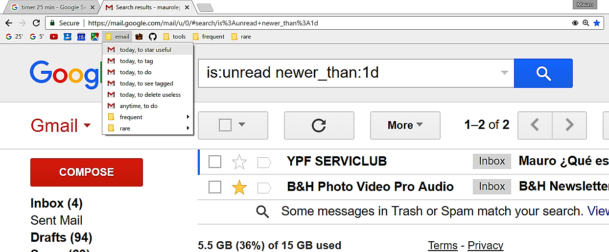

# be\_pragmatic( )

```R
while(alive) {
  be_pragmatic()
  }
```
Program a more productive work and exciting life.

https://github.com/maurolepore/slides

## Abstract

In many fields including science, most critics are unhelpful. Critics will often tell you what is bad, and maybe what is good. What they will rarely tell you is HOW to get from bad to good. Why re-invent the wheel? We can program a more productive work and exciting life. 

We just need to be pragmatic. Being pragmatic means dealing with things sensibly and realistically in a way that is based on practical rather than theoretical considerations. We need to focus less on goals and more on processes; and to value less our rushed-selves and more our future-selves.

## Announcement

This presentation is in development, and should be completed by Jan 19th, 2017.


## [Don't Repeat Yourself (DRY)](https://en.wikipedia.org/wiki/Don't_repeat_yourself)

We are all programmers. 

[Pragmatic programmers](https://en.wikipedia.org/wiki/The_Pragmatic_Programmer) follow the **DRY** principle.

_Every piece of knowledge must have a single, unambiguous, authoritative representation within a system_

--Andy Hunt and Dave Thomas 

## How to program

- Tell a computer WHAT to do

- remind humans (including future you) WHY

WHAT may be obvious, WHY is not.

## Let's program together

Develop a pragmatic approach to check today's emails.

It has to be clear enough, a no brainer. We should be able to do it without thinking, just by following instructions.

## Your solution

<div class="columns-2">

what

- do ...
- do ...
- do ...
- do ...

why

- because I want to ...
- because I want to ...
- because I want to ...
- because I want to ...

</div>

[My solution](https://mail.google.com/mail/u/0/#inbox)


## more

Research is at times:
 
    - (+) creative thus exciting, 
    - (-) repetitive thus boring.

(Officially, roles commonly include: investigating, teaching, administration.)

How to get most out of our day?

(So the boring repetitive bit doesn't overtake the exciting creative bit)

Understand how the creative process works and plan our work around energy levels.


# Outline

(Also based energy levels of the audience)

INTRODUCTION

- The creative process (James Clear blog, and refes thereafter)

- Planning around energy levels (James Clear blog)


RESEARCH'S DAILY CYCLE

(maybe choose different names)

What tasks go where in your day? 

(conceptual)

- Inspire

- Design

- Build

Tasks, tools, tricks

(practical)

Resources/tools

> In preparing for battle, I have always found that plans are useless, but planning is indispensable.
--General Dwight D. Eisenhower

 - to plan and stick to plan (xxxref JC)
      (plans are useless, but planning is essencial)
    - todo list
    - prioritize (xxxref JC)
    - avoid procrastination (xxxref JC)
    - develop healthy habits and stick to them, (xxxJC, Quote Aristotele)
    - manage time in short chunks (pomodoro clock)


- write
    - Turbocharge your writing (techniques)
    - R markdowns (tool); good entry door to R

- to edit
    - Geopen, a paper, super short
    - Style, a book, long but great!

- analyse
    - R
    - R tidyverse
    - R packages + GitHub + pkgdown
    - R markdown documents and notebooks

- capture ideas
    - GitHub Gist
    - GitstBox
    - GistBox Clipper

- develop (and share) ideas
    - GitHub repositories, issues/pull requests

- communicate ideas
    (social considerations)
    - Getting more
    - Convince them in 90 seconds  
> I suppose leadership at one time meant muscles; but today it means **getting along with people**.
--Gandhi  
    (tools)
    - R markdown isoslides
    - Online publishing: Rpubs, bookdown, github


- manage admin (emails, desktop workflow)
    + gmail tools
- collaborate

# INTRODUCTION

## The creative process (James Clear blog, and refes thereafter)

## Planning around energy levels (James Clear blog)

# RESEARCH'S DAILY CYCLE

Inspire

Design

Build

# Emails

## Search emails (e.g. gmail)

Find emails efficiently with [search operators](https://support.google.com/mail/answer/7190?hl=en), e.g.:
(Play with the operators to decide how trustworthy they are. They improve with training)

    - UNREAD TODAY: is:unread newer_than:1d
    - OLD HEAVY EMAILS: larger:3M older_than:1y

Bookmark your common searches, or add Quick Links: 

Gear > Settings > Labs > Quick Links > enable > Save Changes

## Lost emails?

If you don't find what you are looking for, read messages: 

- _Some messages in Trash or Spam match your search. **View messages**_.
- _Improve result with **search options** such as sender, date, size and more._

## Organize emails

- Star emails
- Save star search in Quick Links

## Undo send

Gear > Settings > Enable Undo Send

# Plan

Todo list

How to manage time effectively, and in general how to devlop healthy habits. (James Clear)

Quote Aristotele

- prioritize
- avoid procrastination

# Write

Geopen, a paper, super short

Style, a book, long but great!

# Capture ideas

- GitHub Gist (share optionally)
- GistBox, comlement to enable search of private gists
- GistBox Clipper, complement to create gists from any page

# Develop ideas (share optionally)

GitHub repositories

- ilimited public repos

Researchers

- get 5 private repos free
- get 20 organization repos free

In each repo, use

- Issues
- Pull requests

# Communicate, get along with people

(recycle slides interviews)

- Getting more
- Convince them in 90 seconds

# Wrap up

Show links between data, projects, analysis, emails, issues, gists, ...


=======
---
title: "be_pragmatic( ): Principles to Improve Work and Life"
author: "Mauro Lepore ([edit slides](https://github.com/maurolepore))"
date: "19 January 2017"
output: ioslides_presentation
---

```{r setup, include=FALSE}
knitr::opts_chunk$set(
  comment = "#>",
  collapse = TRUE,
  echo = FALSE
  )
```

## To communicate effectively, tell a story

### **How being pragmatic saved my trio**

[POINT] A pragmatic approach to solving problems saved my PhD thesis, and a personal relationship.

[CONTEXT: WHEN, WHO, WHERE] Two years ago, I was living with a partner in Australia. I was finishing my PhD from home. And because home was a tiny studio, the same space was shared among the three of us: my partner, my PhD and I.

[PROBLEM] Our trio was performing poorly. The problem was that when my partner offered me help with this or that everyday issue, she almost always interrupted my work.

## To communicate effectively tell a story

(continued)

[1-2 FAILED ATTEMPTS] I struggled to find a solution. First I asked my partner to only talk to me when I was not working. When that was? She had no clue, so my first attempt to a solution failed. Moving elsewhere (e.g. the basement, the office at Uni) was an even worse solution: that insulted my partner's capacity to understand my needs and adapt to them.

[SOLUTION] Suddenly eureka! I had heard the same story at the workshop "[Turbocharge your writing](http://www.ithinkwell.com.au/services-turbocharge-your-writing-workshop)". The solution was a cheap device that not only blocked noise but also told my partner when I was working. That device was a pair of bright ear-muffs!

[REPEAT THE POINT] I'm convinced that a pragmatic approach to solving problems can improve your work and life too.

## Outline

### Part 1: From principles to actions

#### Goal 1.1: To learn where to aim.

- Think beyond the immediate problem

    - Improve continuously: kai·zen
    - Stop decay ASAP: don't leave broken windows

#### Goal 1.2: To learn how to actually get there

- Invest in future you (i.e. stop procrastination)

    - Don't repeat yourself
    - Document WHY you do things

- Architect your behaviour

- Focus on systems, not goals

## Outline (continued)

### Brake

- Tell me your pragmatic story

### Part 2: Applications in research

#### Goal 2: See how this principles and models fit our work

- The 5 steps of the creative process

- How the 5 steps model fits our work

- Source of useful principles and tools

- Wrap up / questions and answers

# Part 1: From principles to actions

### Goal 1.1: To learn where to aim.

- Principles are guiding propositions, not rules.

## Think beyond the immediate problem

Place the problem in its larger context.

<div class="columns-2">

Pragmatic people approach problems and solutions with special

- **attitude**
- **style**
- **philosophy**

--

```{r, out.width="50%", echo=FALSE}
knitr::include_graphics("pragmatic_programmer_cover.jpg")
```

</div>

## Improve continuously; stop decay

<div class="columns-2">

### **kai·zen** /kīzən/ (noun) Japanese business philosophy of continuous improvement of working practices, personal efficiency, etc.


```{r, out.width="100%"}
knitr::include_graphics("dont_leave_broken_windows.jpg")
```

### [Neglect accelerates the rot faster than any other factor.](http://www.artima.com/intv/fixit.html) 

</div>


# Part 1: From principles to actions

### Goal 1.2: To learn how to actually get there

- Examples illustrate principles, they are not recipes

### Invest in future-you ([guide to stop procrastinating](http://jamesclear.com/procrastination))


## Don't Repeat Yourself ([DRY](https://en.wikipedia.org/wiki/Don't_repeat_yourself))

Example: use email's [search operators](https://support.google.com/mail/answer/7190?hl=en) and save ([bookmarks](https://goo.gl/9Ev0O1)).

```{r, out.width="100%"}

```

## Document WHY you do things

WHAT may be obvious, WHY is not.

- Tell computers WHAT to do

- Tell humans WHY to do it

Most frequently, **the human you work for** is future you.


### If (only if) it's worthwhile, program

- If a process will likely recur, consider programming it,

- If the time spent to program that process is shorter than the accumulated time the program will eventually save you, **then program it**.

## Architect your behaviour

- [Behaviour can be designed](http://www.nirandfar.com/) (e.g. google, email, facebook)

- [Your environment strongly impacts your behaviour](http://jamesclear.com/habits-visibility-method). 

```{r, out.width="50%", fig.show='hold'}
knitr::include_graphics("behavioural_architect_bad.jpg")
knitr::include_graphics("behavioural_architect_good.jpg")
```

## Focus on [systems, not goals](http://jamesclear.com/goals-systems)

_We are what we repeatedly do. Excellence, then, is not an act, but a habit._

-- Aristotle

--

_It’s Not the Event, It’s the Process._

--James Clear ([stay focused](http://jamesclear.com/stay-focused))

## Recap part 1

We learned principles to know where to aim and how to get there

- Think beyond the immediate problem

    - Improve continuously (kai·zen)
    - Don't neglect (or rot will accelerate)

- Invest in future-you

    - If it is cost-effective, avoid repetition
    - Remind yourself WHY you do things

- Architect your behaviour

- To achieve more, focus on systems (not goals)

# Brake

### Tell me your pragmatic story

# Part 2: Applications in research

## [The 5 steps of the creative process](http://jamesclear.com/five-step-creative-process)

1. **gather material**, 
2. **work intensely** over the material in your mind,
3. **step away** from the problem, 
4. **LET THE IDEA RETURN NATURALLY**,
5. **test and adjust** your idea based on feedback.

## The progress we fell, want and achieve


## How the 5 steps model fits your work?

| Step | time | work |
| :--- | :--- | :--- |
| 1-5 | xxx | xxx |
| ... | xxx | xxx |
| 5 | xxx | xxx |

1. **Gather material**, 
2. **work intensely**,
3. **step away**,
4. **Let the idea return naturally**,
5. **test and adjust**.

Tip: [Manage your energy, not your time](http://jamesclear.com/productivity)

## How the 5 steps model fits my work?

| Where | when | what |
| :--- | :--- | :--- |
| 1, 2 | day/night before | write `(a)`, analyse, ..., park downhill `(b)` |
| 3, 4 | brakes spread along each day | sleep, shower, run, cook, read | 
| 5 `(c)` | earlier sessions | re-write, re-analyse, ..., park downhill |

--

`(a)` _If you think without writing, you only think you're thinking_ (Leslie Lamport).

`(b)` Idea from [Turbocharge your writting](http://www.nature.com/naturejobs/2011/110707/pdf/nj7354-129a.pdf)

`(c)` Note that step 5 is not an exact repetition of 1 and 2 because it starts from a point ahead. The creative process is an iterative spiral.

## Let the idea return naturally

### **This is when I said _eureka!_ over the past few days**

- Start with the ear muffs' story: sleeping
- Show structure of a story: riding my bike
- Talks about HOW to do things, morning shower
- Spiral: doing push-ups
- Asking audience to tell their pragmatic stories: morning shower

## Useful principles and tools

| Task | resource | tool/principle |
| :--- | :------- | :--------- |
| Write (and think) | [Turbocharge your writting](http://www.nature.com/naturejobs/2011/110707/pdf/nj7354-129a.pdf) | principle |
| Edit | [Goepen & Swan](http://www.americanscientist.org/issues/id.877,y.0,no.,content.true,page.1,css.print/issue.aspx); [Style](http://worldwordweb.com/writing/Style%20Lessons%20in%20Clarity%20and%20Grace%20(11th%20Edition).pdf) | principle |
| Communicate | [R Markdown](http://rmarkdown.rstudio.com/) | tool |
| Capture & track ideas | GitHub [Gists](https://help.github.com/articles/about-gists/) & [GistBox](https://app.gistboxapp.com/) | tool |
| Develop ideas into projects | [GitHub](http://r-pkgs.had.co.nz/git.html) repositories and [issues](https://guides.github.com/features/issues/) | tool |

## Useful principles and tools (continued)

| Task | resource | tool/principle |
| :--- | :------- | :--------- |
| Analyse | R Studio ([webinars](https://www.rstudio.com/resources/webinars/)) | tool |
| Analyse | [R for data science](http://r4ds.had.co.nz/), [tidyverse](http://tidyverse.org/) | both |
| Analyse, data management | [Paper](http://vita.had.co.nz/papers/tidy-data.pdf) | principle |
| Data/project management | [GitHub](http://r-pkgs.had.co.nz/git.html), [R Packages](http://r-pkgs.had.co.nz/) | tool |
| Productivity, healthy habits | [James Clear](http://jamesclear.com/articles) | principle |
| Communicate | Convince them in 90 seconds | principle |
| Admin | Google's tools (gmail, sheets, docs) | tool

## Recap part 2

We learned how some useful principles apply to research

- Creativity is a systematic and iterative process

- Progress may feel circular but we move forward in a spiral

- Plan the process of your creative work around your energy

- There are lots of resources for useful principles and tools

More [presentations](https://github.com/maurolepore/slides)

Send me your pragmatic stories and **feedback** ([here](https://github.com/maurolepore) or [email](maurolepore@gmail.com))

--

_There is no such a thing as failure, only feedback._

--[Nicholar Boothman](http://nicholasboothman.com/)

## Questions and answers

maurolepore@gmail.com


>>>>>>> dev
