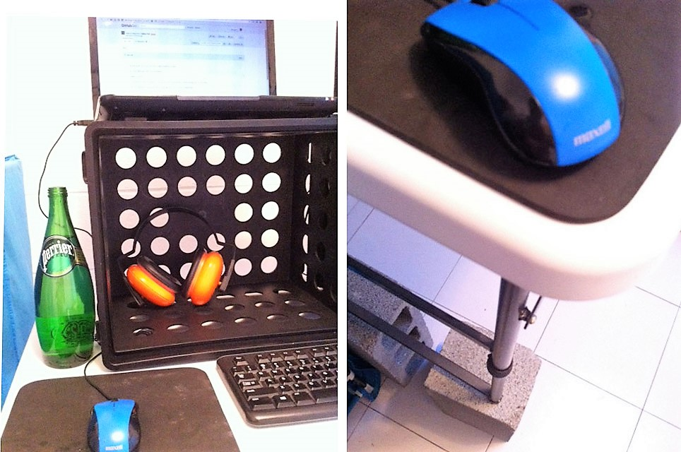

<div class="notes">

xxxnotes; pubish; allow pop-ups; add myslides.html?presentme=true (exit =false)

</div>

```{r setup, include=FALSE}
knitr::opts_chunk$set(
  comment = "#>",
  collapse = TRUE,
  echo = FALSE
  )
```

```{r, eval=FALSE}
# Define pragmatic as per dictionary, dealing with thinkgs practically
# Highlight that the term has at its core HOW things work, PROCESSES
# Tell the story of the ear muffs
```

## What are your pragmatic solutions?

```{r, out.width="100%", echo=FALSE}

```

<div class="notes">

- Connect with audience using a story

    - Tell story of me, my PhD and partner living in a tiny studio

    - Point: pragmatic solutions can improve your work and life

- Start the "conversation" with the audience

    - Ask audience to share their pragmatic solutions

</div>

## Outline

- Where to aim philosophically

- How to get there

- Brake 5' sharp

- Applications in research

- Questions and answers

# From principles to actions

### Where to aim.

- Principles are guiding propositions, not rules.

## Do you think beyond the immediate problem?

<div class="notes">

- The meaning of "pragmatic" I will be using comes from The Pragmatic Programmer

- That book expands its definition to include the ideas we will discuss today

- Ask: Do you leave room for important stuff, or only for urgent stuff?

</div>

### _Solve problems with special [Attitude, style, philosophy](https://www.amazon.com/Pragmatic-Programmer-Journeyman-Master/dp/020161622X)_

```{r, echo=FALSE, out.width="85%", fig.align='center'}
knitr::include_graphics("pragmatic_brain.jpg")
```

## Do you improve continuously?

<div class="notes">

xxx add image of a giant box and a tiny box labelled "These are the faulty ones"

"There's an old(ish) joke about a U.S. company that places an order for 100,000 integrated circuits with a Japanese manufacturer. Part of the specification was the defect rate: one chip in 10,000. A few weeks later the order arrived: one large box containing thousands of ICs, and a small one containing just ten. Attached to the small box was a label that read: "These are the faulty ones. (The pragmatic programmer)"

</div>


### Japanese business philosophy of continuous improvement of working practices & personal efficiency.


## Do you stop rot & see the big picture?

```{r, echo=FALSE, out.width="50%", fig.show='hold'}
knitr::include_graphics("dont_leave_broken_windows.jpg")

```

<div class="notes">

- Research in crime shows that [controlling the small stuff stops bigger issues](https://en.wikipedia.org/wiki/Broken_windows_theory)

</div>

### [_Neglect accelerates the rot faster than any other factor_.](http://www.artima.com/intv/fixit.html)


### Notice change. [Water heating slowly boils frogs alive](https://en.wikipedia.org/wiki/Boiling_frog).

# How to actually get there

- Examples illustrate principles, they are not recipes

## Do you invest in future-you?

### **If it's cost-effective, Don't Repeat Yourself** ([DRY](https://en.wikipedia.org/wiki/Don't_repeat_yourself))

Example: use email's [search operators](https://support.google.com/mail/answer/7190?hl=en) and save ([bookmarks](https://drive.google.com/open?id=0B5fCyFlg2t4pcDlIVHg5VlJZdkE)).

```{r, out.width="100%"}
knitr::include_graphics("check_email.png")
```

### **WHAT** you did is obvious. Document **WHY** you did it.

## Do you design your behaviour?

- [Behaviour can be designed](http://www.nirandfar.com/) (e.g. Google, email, Facebook)

- Focus on [systems, not goals](http://jamesclear.com/goals-systems)

```{r, out.width="50%", fig.show='hold'}
knitr::include_graphics("behavioural_architect_bad.jpg")
knitr::include_graphics("behavioural_architect_good.jpg")
```

## Do you hook new habits to old habits?

```{r, out.width="80%", echo=FALSE, fig.align='center'}
knitr::include_graphics("sink.jpg")
```

### _We are what we repeatedly do. Excellence, then, is not an act, but a habit_ (Aristotle).

# --

```{r, out.width="100%", echo=FALSE, fig.align='center'}

```

### Next: Applications in research

### **github.com/maurolepore/slides**

# Applications in research

## Do you [work around energy](http://jamesclear.com/productivity) or time?

### The [5-step model](http://jamesclear.com/five-step-creative-process)

1. **gather material**, 
2. **work intensely** over the material in your mind,
3. **step away** from the problem, 
4. **LET IDEAS RETURN NATURALLY**,
5. **test and adjust** your idea based on feedback.

```{r, echo=FALSE, out.width="100%", fig.align='center'}

```

(The secret of [the most productive R programmer](https://www.quora.com/How-is-Hadley-Wickham-able-to-contribute-so-much-to-R-particularly-in-the-form-of-packages).)

## When do you usually say _[AHA!](https://youtu.be/lnGeZsv1aBM)_?

<div class="notes">

- Do ideas come to you exactly when you need them or at unexpected times? When?

- Point: if you take brakes you may become more creative.

    - E.g. some very creative people have hobbies & read fantasy books.

xxx serach what google and similar companies do to boost creativity

</div>

(LET IDEAS RETURN NATURALLY.)

```{r, echo=FALSE, out.width="100%", fig.align='center'}

```

--

_AHAs_ are worth [books](https://www.amazon.com/Gopens-Expectation-Approach-English-Language-ebook/dp/B01D0Z7GC6).

## Do you feel you go around in circles?

<div class="notes">

Oftern we feel we go around in circles

- We want to get from A to B, from idea to publication, along a straight line

- Bad news: progress is not linear. Good news: progress is not circular.

- Point: we do move forward, but slowly. And we NEED each iteration to improve.

</div>

### The progress we **feel**, **want** and **achieve**.


## What cognitive/practical tools you use?

<div class="notes">

These are tools I use for different aspects of my research.

- Tools here are both cognitive (ideas, principles) and practical.

- What works for me may not work for you. But it's all here so you can try.

</div>

| Task | resource | practical/cognitive |
| :--- | :------- | :--------- |
| Write (and think [*]) | [Turbocharge your writting](http://www.nature.com/naturejobs/2011/110707/pdf/nj7354-129a.pdf) | cognitive |
| Edit | [Goepen & Swan](http://www.americanscientist.org/issues/id.877,y.0,no.,content.true,page.1,css.print/issue.aspx); [Style](http://worldwordweb.com/writing/Style%20Lessons%20in%20Clarity%20and%20Grace%20(11th%20Edition).pdf) | cognitive |
| Communicate | [R Markdown](http://rmarkdown.rstudio.com/) | practical |
| Capture & track ideas | GitHub [Gists](https://help.github.com/articles/about-gists/) & [GistBox](https://app.gistboxapp.com/) | practical |
| Develop ideas into projects | [GitHub](http://r-pkgs.had.co.nz/git.html) repositories and [issues](https://guides.github.com/features/issues/) | practical |
| Analyse | R Studio ([webinars](https://www.rstudio.com/resources/webinars/)) | practical |

[*] _If you think without writing, you only think you're thinking_ (Leslie Lamport).

## What cognitive/practical tools you use? 

(continued)

| Task | resource | practical/cognitive |
| :--- | :------- | :--------- |
| Analyse | [R for data science](http://r4ds.had.co.nz/), [tidyverse](http://tidyverse.org/) | both |
| Analyse, data management | [Paper](http://vita.had.co.nz/papers/tidy-data.pdf) | cognitive |
| Data/project management | [GitHub](http://r-pkgs.had.co.nz/git.html), [R Packages](http://r-pkgs.had.co.nz/) | practical |
| Productivity, healthy habits | [James Clear](http://jamesclear.com/articles) | cognitive |
| Communicate | [Nicholas Boothman](http://nicholasboothman.com/) | cognitive |
| Admin | Google's tools (gmail, sheets, docs) | practical

## Wrap up, part 1

- Think beyond the immediate problem; improve continuously; don't neglect.

- Invest in future-you; if it is cost-effective, DRY.

- Architect your behavior; focus on systems (not goals).

## Wrap up, part 2

<div class="notes">

The stones soup story shows how sharing and enjoing can be catalized.

- Each villager had something to share, as everyone in the audience

- This talk catalized sharing those ideas, so we all benefit.

</div>

- Creativity is an iterative process; it feels circular but we do move forward (in a spiral).

- Plan creative work around your energy.

- There are lots of cognitive and practical tools for you to try.

--

### **Have you heard the [stones soup story](http://artofprogress.com/2010/06/stone-soup)?**

I hope this discussion is the catalyst for good change (_kaizen_).

# maurolepore@gmail.com 

### **Questions, answers & feedback**

If you can, please give me some feedback. (But you are of course excused if you decide not to do so.) For example, what you liked and disliked the most?

### github.com/maurolepore/slides

# Previous feedback

## 2017-01-17, Julia Schuckel

(Postdoctoral fellow, Lunds Universitet)

"I liked your talk a lot. It kept me engaged the full time. The fact that you gave inside into your personal strategies instead of just talking about theories was really refreshing. And also brave!"

"It inspired me to think about new strategies for myself, and am still thinking about it this evening. So, well done! It was really cool to have had the time to hear from people about their pragmatic solutions, but maybe it’s too much for an hour long talk and you could make a workshop out of it one day :)".

## 2017-01-17, Julia Schuckel (continued)

"In the interest of saving time, you could just talk anecdotally about some of the approaches that people shared today. It's definitely nice to infuse the talk with examples other than yours.  But of course that’s really just a matter of personal style. The part with the email organizing was new to me and a very good idea, but could be a bit more dense, you repeated yourself a little bit there. You probably shorten it automatically next time you speak.
I struggle finding something that I didn’t like!"

## 2017-01-17, changes after feedback

See release `slides` [0.0.1 pragmatic_bambi](https://github.com/maurolepore/slides/releases)


