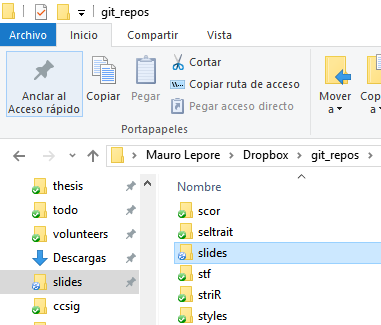
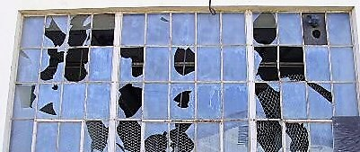

```{r setup, include=FALSE}
knitr::opts_chunk$set(
  comment = "#>",
  collapse = TRUE,
  echo = FALSE
  )
```

## Do useless emails waste our time?

### What process you use to check emails?

DISCUSS

- Can you make it better with little effort to save a lot of accumulated future time?

## Goal: learn principles of pragmatism

<div class="columns-2">

Pragmatic people approach problems and solutions with special

- **attitude**
- **style**,
- **philosophy**

```{r, out.width="50%", echo=FALSE}
knitr::include_graphics("pragmatic_programmer_cover.jpg")
```

</div>

_They **THINK BEYOND THE IMMADIATE PROBLEM**, always trying to place it in its larger context._

--

**kai·zen** /kīzən/ (noun) a Japanese business philosophy of continuous improvement of working practices, personal efficiency, etc.

## Outline

### Part 1: From principles to actions

- Don't repeat yourself,

- Document why you do things,

- If (only if) it's worthwhile, program,

- Keep things where you need them

### Brake

- Don't leave broken windows

- Recap part 1

### Part 2: Applications in research

- The 5 steps of the creative process

- How the 5 steps model fits our work

- Source of useful principles and tools

- Wrap up / questions and answers

# Part 1

### From principles to actions

- Principles are guiding propositions, not rules.

- I provide examples, not recipes.

## Don't Repeat Yourself ([DRY](https://en.wikipedia.org/wiki/Don't_repeat_yourself))

Example: use and save [search operators](https://support.google.com/mail/answer/7190?hl=en) to check emails.

```{r, out.width="100%"}
knitr::include_graphics("check_email.png")
```

## Document WHY you do things

- Tell computers WHAT to do

- Tell humans `(*)` WHY to do it

WHAT may be obvious, WHY is not.

`(*)` Most frequently the human you work for is future you.

## If (only if) it's worthwhile, program

> If a process will recur, consider programming it,

> If the time spent to program that process is shorter than the accumulated time the program saves, **then programm it**.

## Keep things where you need them

<div class="columns-2">

```{r, out.width="100%"}

```

- Environment strongly determines behaviour. 

- Architect your environment to favor actions you want to take.

</div>

# Brake

<div class="columns-2">

```{r, out.width="100%"}

```

["Don't leave broken windows"](http://www.artima.com/intv/fixit.html)

After the brake, we'll discuss

### Why?

</div>

## Recap part 1

- DRY,

- Care for future-you (i.e. [stop procrastinating](http://jamesclear.com/procrastination)),

- **kai·zen**, i.e. improve continuously,

- [Stop decay ASAP; neglect accelerates rot](http://www.artima.com/intv/fixit.html) 

# Part 2: Applications in research

## [The 5 steps of the creative process](http://jamesclear.com/five-step-creative-process)

1. **gather material**, 
2. **work intensely** over the material in your mind,
3. **step away** from the problem, 
4. **LET THE IDEA RETURN NATURALLY**,
5. **test and adjust** your idea based on feedback.

> There is no such a thing as failure, only feedback.

--[Nicholar Boothman](http://nicholasboothman.com/)


## How the 5 steps model fits my work?

| where | when | what |
| :--- | :--- | :--- |
| 1, 2 | day/night before | write `(a)`, analyse, ..., park downhill `(b)` |
| 3, 4 | brakes spread along each day | sleep, shower, run, cook, read | 
| 5 `(c)` | earlier sessions | re-write, re-analyse, ..., park downhill |

--

`(a)` "If you think without writing, you only think you're thinking" (Leslie Lamport).

`(b)` Idea from [Turbocharge your writting](http://www.nature.com/naturejobs/2011/110707/pdf/nj7354-129a.pdf)

`(c)` Note that step 5 is not an exact repetition of 1 and 2 because it starts from a point ahead. The creative process is iterative but eliptic, not circular.

## How the 5 steps model fits your work?

| Step | time | work |
| :--- | :--- | :--- |
| 1-5 | xxx | xxx |
| ... | xxx | xxx |
| 5 | xxx | xxx |

1. **Gather material**, 
2. **work intensely**,
3. **step away**,
4. **Let the idea return naturally**,
5. **test and adjust**.

Tip: [Manage your energy, not your time](http://jamesclear.com/productivity)

## Source of useful principles and tools

| Task | resource | tool/principle |
| :--- | :------- | :--------- |
| Think = write a lot | Turbocharge your writting | principle |
| Write | markdown | tool |
| Edit | [Gopen's paper](xxxref), [Style](xxxref) | principle |
| Capture ideas | GitHub Gists and GistBox | tool |
| Develop ideas into projects | GitHub repositories and issues | tool |

## Principles and tools (continued)

| Task | resource | tool/principle |
| :--- | :------- | :--------- |
| Analyse | R Studio, R studio webinars | tool |
| Analyse | R for data science ([Hadley Whicham]) | both |
| Analyse, data management | Paper and package by ([Hadley Whicham]) | both |
| Data/project management | GitHub, R Packages (xxxref) | tool |
| Productivity, healthy habits | James Clear (xxxref) | principle |
| Communicate | Convince them in 90 seconds | principle |
| Communicate | R Markdown documents (slides, notebooks, books, webpages) | tool |
| admin | google products | gmail (offline), sheets, docs, forms | tool


James Clear's [blog](http://jamesclear.com/) and from 

_Hooked_ ([Nir Eyal](http://www.nirandfar.com/))


## Wrap up


xxxnext revise and simplify outline, separate outline from presentation, write wrap ups.


## More


