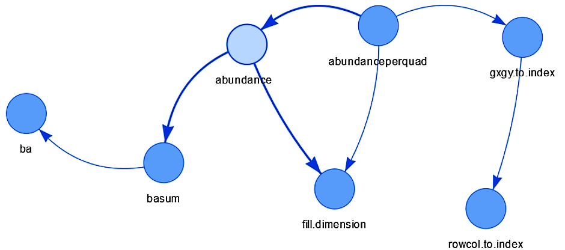
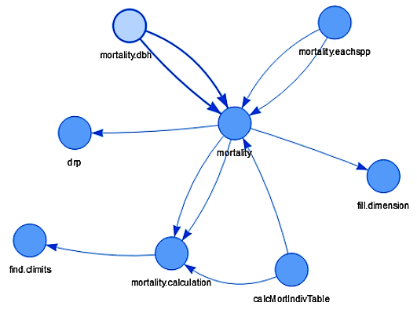

```{r removeSlideNumbers, include=FALSE}
# From https://github.com/rstudio/rmarkdown/issues/244
# To remove slide numbers to one of two things:

# One: Place this under the yamal header of the .Rmd file

# <style type="text/css">
# slides > slide:not(.nobackground):after {
#   content: '';
# }
# </style>


# Or, two: Place this in a separate mystyle.css file (remove <style> tag)

# slides > slide:not(.nobackground):after {
#   content: '';
# }

# For approach two, the yamal header should look like this:
# ---
# output:
#   ioslides_presentation:
    # css: mystyles.css
# ---
```

```{r setup, include=FALSE}
library(tidyverse)
library(lubridate)
library(knitr)
library(ctfs)
library(DependenciesGraphs)
library(handy)


load("./functions_priority.rda")


functions_priority <- functions_priority %>% mutate_at("priority", as.character)


knitr::opts_chunk$set(
  comment = "#>",
  collapse = TRUE,
  # fig.align = "center",
  fig.asp = 0.618,
  fig.width = 6,
  out.width = "90%",
  cache = TRUE,
  echo = FALSE 
  )
# If you want to make sure the font size is consistent across all your figures,
# whenever you set out.width, you’ll also need to adjust fig.width to maintain
# the same ratio with your default out.width. For example, if your default
# fig.width is 6 and out.width is 0.7, when you set out.width = "50%" you’ll
# need to set fig.width to 4.3 (6 * 0.5 / 0.7).
# plots


```


# Workplan Aug 24'17-May 1'18 | Review and Discuss

### https://bookdown.org/forestgeoguest/workplan_ml


## Task Listed in Job Description

1. __Build forestr.__ Produce and maintain a package sensu stricto.

1. __Host on GitHub.__ Set up a fully documented and active code repository.

1. __Document functions.__ Fully document the functions including help files.

1. __Optimize for speed__. Add contributions.

1. __Add contributions.__ Integrate code written by other researchers.

1. __\*Interact with database.__ Write functions to interact directly with output tables from the MySQL database. 

1. __\*Wrangle data.__ Write functions to pre-process and format CTFS-ForestGEO data.

* Please clarify.


## 

```{r timeline, echo=FALSE}
# Check if the problem is that dates need to be character vectors

timeline <- tribble(
  ~n,  ~mlst,  ~extra, ~task,                     ~date_start,    ~date_end,    ~progress,  ~note,
   1,   F,     F,      "Build forestr",           "2017-02-01",  "2017-08-07",  "done",     "also ctfs",
   1,   T,     F,      "Maintain forestr",        "2017-08-05",  "2017-09-28",  "todo",     "family abundance (~ xxx funs)",
   1,   F,     F,      "Maintain forestr",        "2017-02-01",  "2018-05-01",  "cont",     "",
   1,   T,     F,      "Maintain forestr",        "2017-10-02",  "2017-11-02",  "todo",     "family biomass (~ xxx funs)",
  
   2,   F,     F,      "Host on GitHub",          "2017-02-01",  "2017-08-07",  "done",     "forstr",
   3,   F,     F,      "Document functions",      "2017-02-01",  "2018-05-01",  "cont",     "reviews welcome",
   4,   F,     F,      "Optimize for speed",      "2018-02-01",  "2018-05-01",  "cont",     "human brain, code",
   
   5,   F,     F,      "Add contributions",       "2017-03-09",  "2018-05-01",  "cont",     "ttt, Ervan, other",
   5,   T,     F,      "Add contributions",       "2017-03-09",  "2017-09-15",  "cont",     "ttt",
  
   6,   F,     F,      "Interact with database",  "2017-07-21",  "2018-05-01",  "cont",     "~rtbl?, confirm task and prioriry",
  
   7,   F,     F,      "Wrangle data",            "2017-07-21",  "2018-05-01",  "todo",     "~rtbl?, confirm task and prioriry",
   7,   T,     F,      "Wrangle data",            "2017-07-21",  "2017-11-01",  "todo",     "rtbl.bci",
   
   # Other important stuff that is not in job description
   8,   F,     T,     "Package example data",    "2017-07-28",  "2017-09-15",  "todo",     "bciex",
   9,   F,     T,     "Provide beta access",     "2017-07-29",  "2017-07-30",  "cont",     "try",
  10,   F,     T,     "Meet PIs",                "2017-09-29",  "2017-09-29",  "todo",     "Krista (SCBI)"
)
timeline <- timeline %>% 
  mutate_at(c("date_start", "date_end"), lubridate::as_date) %>% 
  mutate(task = forcats::fct_reorder(as.factor(task), rev(n)))
```

```{r timeline-listed}
aesthetics <- aes(x = task, y = date_start, xend = task, yend = date_end, linetype = progress, colour = progress)

timeline %>% 
  filter(!mlst, !extra) %>% 
  ggplot() +
  geom_segment(aesthetics, size = .75) +
  geom_hline(
    yintercept = as.numeric(lubridate::as_date(lubridate::today())),
    colour = "white", size = 2
  ) +
  geom_segment(aesthetics, size = .75) +
  labs(title = "Timeline of tasks listed in job description.", y = "date") +
  coord_flip()
```


##

```{r timeline-extras, warning=FALSE}
timeline %>% 
  filter(!mlst, extra) %>% 
  ggplot() +
  geom_segment(aesthetics, size = .75) +
  geom_hline(
    yintercept = as.numeric(lubridate::as_date(lubridate::today())),
    colour = "white", size = 2
  ) +
  geom_segment(aesthetics, size = .75) +
  geom_point(aesthetics) +
  labs(title = "Example of some extra tasks.", y = "date") +
  coord_flip(ylim = as_date(c("2017-02-01", "2018-05-01")))
```


## 

```{r all-functions-count}
total_functions_n <- functions_priority %>% nrow()
```

### How many functions there were in total? `r total_functions_n`

```{r selected-functions, echo=FALSE}
selected_functions <- functions_priority %>% filter(priority %in% c("a", "b"))
selected_functions_n <- nrow(selected_functions)
```

### How many functions were selected to work on? `r selected_functions_n`

```{r}
value <- round(selected_functions_n / total_functions_n * 100)
```

### That is `r paste0(value, "%")`

##

```{r funs-per-module}
selected_functions %>% 
  dplyr::count(folder) %>% 
  dplyr::filter(!is.na(folder)) %>% 
  arrange(n) %>% 
  kable(caption = "Number of functions to keep from each module.")
```


##

```{r depencencies-abundance}
selected_functions %>% 
  filter(folder %in% "abundance") %>% 
  select(-notes) %>% 
  kable(caption = "Dependencies per function. Example for `abundance()`)")
```


##

```{r, include=FALSE}
explore_dependencies("ctfs", "abundanceperquad")
```




##

```{r dependencies-mortality}
selected_functions %>% 
  filter(folder %in% "mortality") %>% 
  select(-notes) %>% 
  kable(caption = "Dependencies per function. Example for `mortality()`)")
```


##

```{r, include=FALSE}
explore_dependencies("ctfs", "mortality")
```




##

```{r, out.width="45%"}
include_graphics(c("change_1.png", "change_2.png"))
```


# Discussion Task by Task


## Excluded functions of priority c

```{r}
functions_priority %>% 
  filter(priority %in% c("c")) %>% 
  pull(fun) %>% 
  paste(collapse = ", ")
```

## Excluded functions of priority d

```{r}
functions_priority %>% 
  filter(priority %in% c("d")) %>% 
  pull(fun) %>% 
  paste(collapse = ", ")
```


# Main Goals

## update the package.

1. update the package.
    1. curate: decide what functions are useful and worthwhile keeping. DONE
    1. document: improve help files.
        1. titles, description and details.
        1. argumets (reuse templates)
        1. authors
        1. group related functions in one place
        1. add examples
        1. build a website
    1. validate: validate inputs or warn and err accoridingly. This helps users
       to understand what went wrong.
    1. test: This helps developers to notice that something  went wrong so they 
       can promptly fix it.
        1. regression tests: check old and new versions of a function outut the
           same.
        1. test that functions do what they are expected to do.
        1. checks: devtools::check()
        1. __lintr__ to check for style
        1. __goodpractice::gp()__ to check for general good practices
        1. TravisCI to check package builds on all platforms.
    1. refactor: re-write code to improve it. E.g.
        1. names: make them more elocuent, consistent
        1. arguments: 
            1. name arguments more elocuently
            1. order arguments more sensibly (data, details)
            1. give arguments most common or safest defaults
        1. code: 
            1. improve style for better readability and consistency with modern
               style guides.
            1. improve safety
            1. reduce complexity
                1. reduce nestedness (mostly unnecessary _if_ blocks)
                1. remove the boilperate code of `for` loops by replaceing `for`
                   loops by functional programming approaches (most generally,
                   calls  to `lapply(X, FUN)`)
            1. improve clarity


## optimize the package.

    1. Human brain(human brain): make useful code easier to find and use.
        1. naming functions better.
        1. grouping functions coherently.
        1. writting more complete and clearer documentation (goepen)
        1. facilitating access to documentation via websites
        1. announcing advances on twitter, workshops
        1. facilitating disussions on GitHub
        1. building capacity via code reviews, workshops, seminars, tutorials.
    1. Access to data:
        1. provide easy access to data for examples (__bci__, __bciex__).
        1. help the community to develop their own data packages.
        1. help the community to develop a friction-less workflow
    1. Code speed
        1. provide light data for examples and tests to run fast (__bciex__) 
        1. identify speed bottlenecks (__profviz__)
        1. replace slow by fast code. E.g. compare __base__ vs. __dplyr__ vs.
           __data.table__

## establish a framework for future maintenance and expansion.

    1. build R packages _sensu stricto__
    1. create platforms for:
        1. github.com/forestgeo:
            1. hosting code repositories, packages and package websites
            1. discussing current issues, proposed changes, collaboration, etc.
            1. managing collaboration
        1. (rpubs.com/forestgeo): publishing R products publicly
        1. bookdown.com/forestgeoguest: publishing R products 
           with privileges control
        1. @forestgeo, #forestgeo, #forestr, etc.: announcing developments.


# Summary

```{r}
caption <- "Summary of work plan for Sep'17-May'18."
tribble(
  
  ~task, ~priority, ~note,
  # -----------------------------------------------------------------------
  "xxx", "yyy", "zzz",
  "xxx", "yyy", "zzz",
  "xxx", "yyy", "zzz",
  "xxx", "yyy", "zzz",
  "xxx", "yyy", "zzz",
  "xxx", "yyy", "zzz",
  "xxx", "yyy", "zzz",
  "xxx", "yyy", "zzz"
  # -----------------------------------------------------------------------
)
```


## Thanks for helping and sharing your ideas!

#

end.


## Comments about TASKS

Catagories

(1) Produce and maintain a package sensu stricto

Optimization and expantion is important but some updates come first (documentation, assertions, tests)


(4) Optimize code for speed.

If time allows, do this towards the end of the first period


(7) Write new functions to help in the pre-processing and formatting of CTFS-ForestGEO data. 

Assuming these functions are the ones that Suzanne shared with me, i.e. those which purpose is to produce r-tables from database data (__rtbl__)

Probabbly after releasing some module of __forestr__, e.g. after releasing abundance. If so, I may work on __rtbl__ during October and hav it finished by the end of October.


# Leftovers


## GENERAL TRAITS

Clearly document help pages.
Write easy-to-read code.
Communicate and understand the needs of a broad range of researchers and students.


# SKILLS

## Required skills: 

(1) Experience in building R packages, good understanding of S3 and S4 methods, and knowledge of generic R work as well as R environments. 

(2) Experience in git and github. 

(3) Experience in code debugging, profiling, and optimizing. 

(4) Strong attention to detail and organizational skills. 


## Desirable skills: 

(1) Experience with R Markdown and Shiny. 

(2) Experience with lower level languages, ideally C++. 

(3) Previous experience with forest ecology or plant dynamics.
